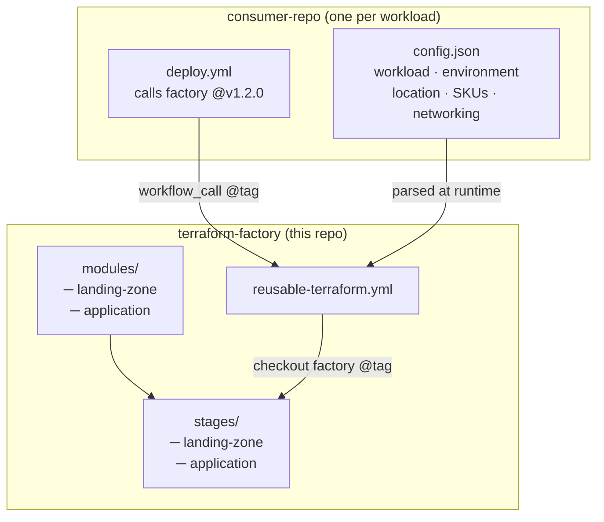
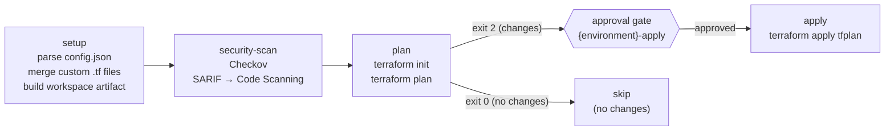
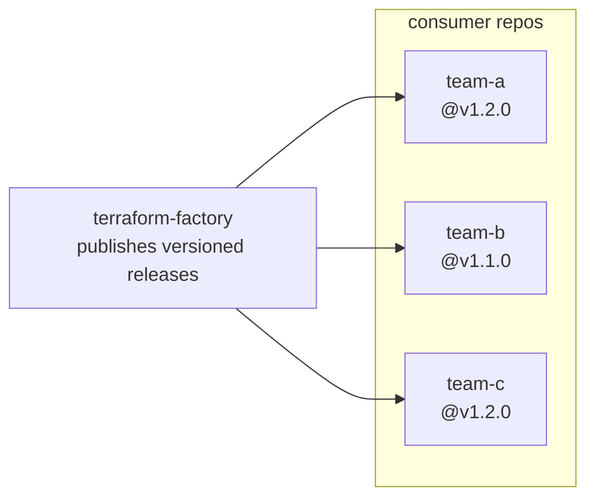
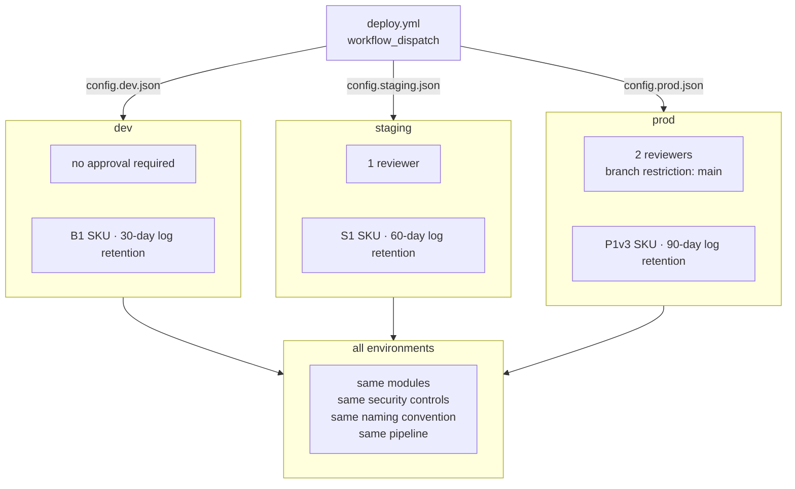
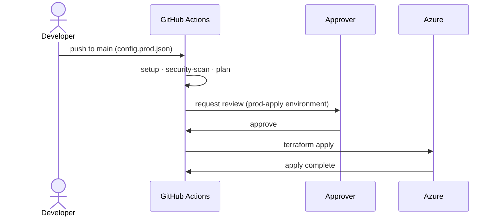

# Terraform Factory — Architecture

## The Problem

Without a central approach, teams end up copy-pasting Terraform, each maintaining their own pipelines, inventing their own naming conventions, and applying security controls inconsistently. The factory pattern solves this.

---

## How It Works

The factory uses a **two-repo pattern**. The factory repo owns all Terraform code, security policy, and the reusable pipeline. Consumer repos contain only a `config.json` and a thin deploy workflow — no Terraform knowledge required.



The consumer never contains Terraform code. When the pipeline runs, it checks out the factory at the pinned tag, parses `config.json`, generates `terraform.auto.tfvars.json`, and runs the stages from the factory's own codebase.

---

## Pipeline Flow

Every deployment goes through four sequential jobs. The apply is gated behind a GitHub Environment — a human must approve before any infrastructure changes land.



Pull requests only reach `plan` — `apply` only runs on merge to `main` after approval.

---

## Managing Infrastructure at Scale

### Centralised Standards

All security controls, naming conventions, and provider configuration live in a single place. When the factory ships a fix — stricter TLS, a new diagnostic setting, a Checkov skip removal — every consumer gets it on their next version bump.



Teams pin independently and upgrade at their own pace. A breaking change bumps the major version — consumers choose when to adopt it.

### What Each Team Supplies

A consumer only needs to know four things:

| Field | Example |
|-------|---------|
| `workload` | `myapp` |
| `environment` | `prod` |
| `location` | `uksouth` |
| `location_short` | `uks` |

Every resource name, diagnostic setting, and security default flows from those four values.

### Derived Naming

Resource names are never manually specified — they are derived by the factory using a consistent pattern:

```
{prefix}-{workload}-{environment}-{location_short}
```

| Resource | Example name |
|----------|-------------|
| Resource group | `rg-myapp-prod-uks` |
| Virtual network | `vnet-myapp-prod-uks` |
| Key Vault | `kv-myapp-prod-uks` |
| Log Analytics | `log-myapp-prod-uks` |
| App Service Plan | `asp-myapp-prod-uks` |
| App Service | `app-myapp-prod-uks` |
| SQL Server | `sql-myapp-prod-uks` |

This eliminates naming drift and makes any resource instantly identifiable from its name alone.

---

## Handling Environment Differences

### One Config File Per Environment

The same factory modules deploy to every environment. Differences are expressed only through config values — not code.



Changing `environment` from `dev` to `prod` in `config.json` automatically adjusts every derived resource name — no manual renaming.

### Approval Gates

Each environment maps to a GitHub Environment protection rule. The `apply` job targets `{environment}-apply`, so the gate is enforced automatically based on which config file the pipeline was triggered with.



If the plan exits with no changes (exit code `0`), the apply job is skipped entirely — no approval request is raised.

---

## Security Controls (Built In)

These are enforced by the factory for every deployment regardless of what the consumer config says:

| Control | Where enforced |
|---------|---------------|
| HTTPS-only App Service | `app_service.tf` |
| TLS 1.2 minimum | App Service + SQL Server |
| System-assigned managed identity | App Service |
| SQL password generated + stored in Key Vault | `sql.tf` — never in config or state in plaintext |
| SQL admin object ID resolved via AAD data source | `sql.tf` — never manually looked up |
| Key Vault RBAC (not legacy access policies) | `keyvault.tf` |
| Soft delete + purge protection on Key Vault | `keyvault.tf` |
| All resources emit diagnostics to Log Analytics | Per-resource diagnostic settings |
| Checkov scan on every plan | `reusable-terraform.yml` |
